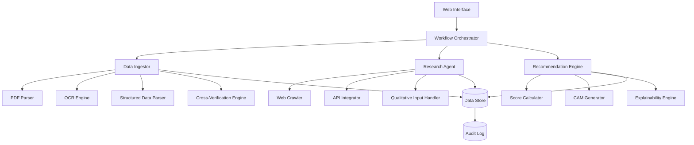
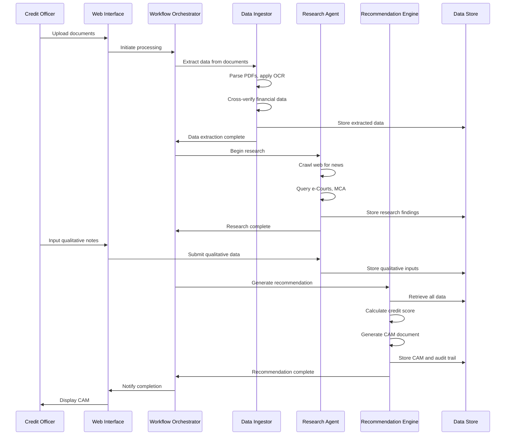

# Design Document: Intelli-Credit Engine

## Overview

Intelli-Credit is an AI-powered Credit Decisioning Engine that automates the preparation of Comprehensive Credit Appraisal Memos (CAM) for Indian corporate lending. The system follows a three-stage pipeline architecture:

1. **Data Ingestor**: Extracts and normalizes data from multi-format documents
2. **Research Agent**: Performs automated web research and integrates qualitative inputs
3. **Recommendation Engine**: Synthesizes all data into a professional CAM with lending recommendations

The system is designed to handle the complexity of Indian financial documents, regulatory filings, and context-specific requirements while maintaining transparency and explainability in all credit decisions.

## Architecture

### High-Level Architecture



### Component Interaction Flow



## Components and Interfaces

### 1. Workflow Orchestrator

**Responsibility**: Coordinates the execution of all pipeline stages and manages state transitions.

**Interface**:
```python
class WorkflowOrchestrator:
    def initiate_processing(self, application_id: str, documents: List[Document]) -> ProcessingJob
    def get_job_status(self, job_id: str) -> JobStatus
    def cancel_job(self, job_id: str) -> bool
    def retrieve_results(self, job_id: str) -> ProcessingResults
```

**Key Operations**:
- Validates uploaded documents
- Triggers Data Ingestor with document batch
- Monitors Data Ingestor completion
- Triggers Research Agent with extracted company/promoter data
- Triggers Recommendation Engine when all data is available
- Manages error handling and retry logic

### 2. Data Ingestor

**Responsibility**: Extracts, parses, and normalizes data from multiple document formats.

**Interface**:
```python
class DataIngestor:
    def ingest_documents(self, documents: List[Document]) -> IngestionResult
    def extract_from_pdf(self, pdf_document: PDFDocument) -> ExtractedData
    def parse_structured_data(self, structured_file: StructuredFile) -> ParsedData
    def cross_verify_data(self, data_sources: List[DataSource]) -> VerificationReport
```

**Sub-Components**:

#### PDF Parser
- Extracts text from native PDF documents
- Identifies tables, financial statements, and key sections
- Uses rule-based extraction for standard formats (annual reports, sanction letters)

#### OCR Engine
- Processes scanned/image-based PDFs
- Applies image enhancement (deskewing, noise reduction, contrast adjustment)
- Uses AWS Textract or Google Document AI for OCR
- Post-processes OCR output to correct common errors

#### Structured Data Parser
- Parses GST returns (GSTR-2A, GSTR-3B) in JSON/XML format
- Parses ITR forms in JSON/XML format
- Parses bank statements in CSV/Excel format
- Normalizes all data into common schema

#### Cross-Verification Engine
- Compares revenue figures from GST returns vs bank statements
- Calculates variance percentages
- Flags discrepancies above threshold (e.g., >10%)
- Compares GSTR-2A vs GSTR-3B for input tax credit mismatches
- Generates verification report with confidence scores

**Data Model**:
```python
class ExtractedData:
    source_document: str
    extraction_timestamp: datetime
    confidence_score: float
    financial_metrics: Dict[str, FinancialMetric]
    risk_indicators: List[RiskIndicator]
    raw_text: str
    
class FinancialMetric:
    metric_name: str
    value: float
    unit: str
    period: str
    confidence: float
    source_page: int
    
class VerificationReport:
    verified_pairs: List[VerificationPair]
    discrepancies: List[Discrepancy]
    overall_confidence: float
    
class Discrepancy:
    metric_name: str
    source1_value: float
    source2_value: float
    variance_percentage: float
    severity: str  # "low", "medium", "high"
    potential_issue: str  # e.g., "circular trading", "revenue inflation"
```

### 3. Research Agent

**Responsibility**: Performs automated web research and integrates external data sources.

**Interface**:
```python
class ResearchAgent:
    def research_company(self, company_name: str, promoters: List[str]) -> ResearchReport
    def search_news(self, entity_name: str, lookback_days: int) -> List[NewsArticle]
    def query_ecourts(self, entity_name: str) -> LitigationHistory
    def fetch_mca_filings(self, cin: str) -> MCAFilings
    def accept_qualitative_input(self, application_id: str, notes: QualitativeNotes) -> bool
    def adjust_risk_score(self, base_score: float, qualitative_factors: List[Factor]) -> float
```

**Sub-Components**:

#### Web Crawler
- Uses search APIs (Google Custom Search, Bing Search) to find relevant news
- Crawls Indian news sources (Economic Times, Business Standard, Mint, etc.)
- Extracts article text, publication date, and source
- Filters for relevance using keyword matching and NLP
- Deduplicates articles

#### API Integrator
- Integrates with e-Courts API for litigation search
- Integrates with MCA API for corporate filings
- Integrates with CIBIL API for credit reports (if available)
- Handles API authentication, rate limiting, and retries

#### Qualitative Input Handler
- Provides web form for Credit Officers to input notes
- Categorizes notes (factory visit, management interview, market feedback)
- Extracts sentiment and key risk factors from notes using NLP
- Maps qualitative factors to quantitative risk adjustments

**Data Model**:
```python
class ResearchReport:
    company_name: str
    promoters: List[str]
    news_articles: List[NewsArticle]
    litigation_history: LitigationHistory
    mca_filings: MCAFilings
    sector_analysis: SectorAnalysis
    qualitative_notes: List[QualitativeNotes]
    research_timestamp: datetime
    
class NewsArticle:
    title: str
    source: str
    publication_date: date
    url: str
    summary: str
    sentiment: str  # "positive", "neutral", "negative"
    relevance_score: float
    
class LitigationHistory:
    total_cases: int
    pending_cases: int
    case_details: List[CaseDetail]
    
class CaseDetail:
    case_number: str
    case_type: str
    filing_date: date
    status: str
    court_name: str
    
class QualitativeNotes:
    note_id: str
    credit_officer: str
    timestamp: datetime
    category: str
    content: str
    sentiment: str
    risk_impact: str  # "positive", "neutral", "negative"
```

### 4. Recommendation Engine

**Responsibility**: Synthesizes all data into a credit score and generates the CAM document.

**Interface**:
```python
class RecommendationEngine:
    def calculate_credit_score(self, application_data: ApplicationData) -> CreditScore
    def generate_cam(self, application_data: ApplicationData, credit_score: CreditScore) -> CAMDocument
    def explain_decision(self, credit_score: CreditScore) -> ExplanationReport
    def suggest_loan_terms(self, credit_score: CreditScore, application_data: ApplicationData) -> LoanTerms
```

**Sub-Components**:

#### Score Calculator
- Implements Five Cs framework:
  - **Character**: Based on promoter background, litigation history, news sentiment
  - **Capacity**: Based on revenue, profitability, debt service coverage ratio
  - **Capital**: Based on net worth, equity contribution
  - **Collateral**: Based on asset valuation, security coverage
  - **Conditions**: Based on sector analysis, economic conditions
- Uses weighted scoring model with configurable weights
- Applies qualitative adjustments from Research Agent
- Generates score breakdown showing contribution of each factor

#### CAM Generator
- Uses document templates (Word/PDF)
- Populates template with extracted data, research findings, and analysis
- Structures CAM into standard sections:
  - Executive Summary
  - Company Background
  - Promoter Profile
  - Financial Analysis
  - Industry and Market Analysis
  - Risk Assessment
  - Collateral Evaluation
  - Recommendation and Terms
  - Supporting Documents and References
- Formats tables, charts, and financial statements
- Generates table of contents and page numbers

#### Explainability Engine
- Generates natural language explanations for credit score
- Links each score component to specific evidence
- Provides "what-if" analysis showing impact of changing key factors
- Generates rejection reasons with specific evidence
- Creates visual score breakdown (charts, graphs)

**Data Model**:
```python
class CreditScore:
    overall_score: float  # 0-100
    grade: str  # "AAA", "AA", "A", "BBB", "BB", "B", "C"
    five_cs_breakdown: FiveCsBreakdown
    risk_level: str  # "low", "medium", "high"
    confidence: float
    
class FiveCsBreakdown:
    character_score: float
    character_factors: List[ScoringFactor]
    capacity_score: float
    capacity_factors: List[ScoringFactor]
    capital_score: float
    capital_factors: List[ScoringFactor]
    collateral_score: float
    collateral_factors: List[ScoringFactor]
    conditions_score: float
    conditions_factors: List[ScoringFactor]
    
class ScoringFactor:
    factor_name: str
    weight: float
    value: float
    contribution: float
    evidence: List[Evidence]
    
class Evidence:
    source_type: str  # "document", "research", "qualitative"
    source_reference: str
    excerpt: str
    confidence: float
    
class LoanTerms:
    recommended_amount: float
    maximum_amount: float
    interest_rate_range: Tuple[float, float]
    tenure_months: int
    conditions: List[str]
    covenants: List[str]
    
class CAMDocument:
    document_id: str
    application_id: str
    generation_timestamp: datetime
    format: str  # "docx", "pdf"
    content: bytes
    sections: List[CAMSection]
    references: List[Reference]
```

## Data Models

### Core Entities

```python
class LoanApplication:
    application_id: str
    company_name: str
    cin: str  # Corporate Identification Number
    promoters: List[Promoter]
    requested_amount: float
    requested_tenure_months: int
    purpose: str
    submission_date: datetime
    status: str
    
class Promoter:
    name: str
    pan: str
    role: str
    shareholding_percentage: float
    
class Document:
    document_id: str
    application_id: str
    document_type: str  # "annual_report", "gst_return", "itr", "bank_statement", etc.
    file_name: str
    file_format: str
    upload_timestamp: datetime
    file_content: bytes
    
class ProcessingJob:
    job_id: str
    application_id: str
    status: str  # "queued", "ingesting", "researching", "generating", "complete", "failed"
    progress_percentage: float
    current_stage: str
    start_time: datetime
    end_time: Optional[datetime]
    error_message: Optional[str]
```

### Database Schema

The system uses a relational database (PostgreSQL) for structured data and object storage (S3) for documents and generated CAMs.

**Tables**:
- `loan_applications`: Core application data
- `promoters`: Promoter information
- `documents`: Document metadata (content in S3)
- `extracted_data`: Structured data extracted from documents
- `financial_metrics`: Individual financial metrics with confidence scores
- `research_findings`: News articles, litigation records, MCA filings
- `qualitative_notes`: Credit Officer inputs
- `credit_scores`: Calculated scores with breakdowns
- `cam_documents`: Generated CAM metadata (content in S3)
- `audit_logs`: Complete audit trail of all operations

## Correctness Properties

*A property is a characteristic or behavior that should hold true across all valid executions of a system—essentially, a formal statement about what the system should do. Properties serve as the bridge between human-readable specifications and machine-verifiable correctness guarantees.*


### Property 1: Multi-Format Document Extraction
*For any* valid document in supported formats (PDF, scanned PDF, GST returns, ITRs, bank statements), the Data_Ingestor should successfully extract structured data and return it in the normalized schema.
**Validates: Requirements 1.1, 1.2, 1.3**

### Property 2: Batch Processing Completeness
*For any* batch of multiple documents in different formats, the Data_Ingestor should process all documents and consolidate all extracted data into a single result set.
**Validates: Requirements 1.4**

### Property 3: Error Isolation
*For any* batch of documents containing at least one invalid document, the Data_Ingestor should log the error for the invalid document and successfully process all valid documents without interruption.
**Validates: Requirements 1.5**

### Property 4: Cross-Verification Detection
*For any* pair of GST returns and bank statements with revenue discrepancies exceeding the threshold, the Data_Ingestor should flag the discrepancy and identify the potential issue type (circular trading or revenue inflation).
**Validates: Requirements 2.1, 2.2**

### Property 5: GST Form Comparison
*For any* pair of GSTR-2A and GSTR-3B forms, the Data_Ingestor should correctly identify and report all differences in input tax credit between claimed and available amounts.
**Validates: Requirements 2.3**

### Property 6: Variance Calculation Accuracy
*For any* two numerical values from different sources, the calculated variance percentage should equal the mathematical formula: |value1 - value2| / value1 * 100.
**Validates: Requirements 2.4**

### Property 7: Discrepancy Report Completeness
*For any* cross-verification process that detects discrepancies, all detected discrepancies should appear in the generated summary report.
**Validates: Requirements 2.5**

### Property 8: Research Execution Completeness
*For any* company name and list of promoters, the Research_Agent should execute all research tasks: web crawling for news, e-Courts litigation search, and MCA filings retrieval.
**Validates: Requirements 3.1, 3.3, 3.4**

### Property 9: Sector Research Coverage
*For any* sector identifier, the Research_Agent should retrieve and return sector-specific regulatory changes and market conditions.
**Validates: Requirements 3.2**

### Property 10: Research Report Consolidation
*For any* completed research process, all findings (news articles, litigation records, MCA filings, sector analysis) should be included in the structured report with source citations.
**Validates: Requirements 3.5**

### Property 11: Qualitative Data Association
*For any* qualitative notes submitted for a loan application, the notes should be correctly associated with that specific application and retrievable when generating the CAM.
**Validates: Requirements 4.2, 4.5**

### Property 12: Risk Score Adjustment Bidirectionality
*For any* qualitative notes with identified sentiment (positive or negative), the risk score should be adjusted in the corresponding direction (positive notes increase score, negative notes decrease score).
**Validates: Requirements 4.3, 4.4**

### Property 13: CAM Generation Success
*For any* loan application with complete data (extracted documents, research findings, qualitative notes), the Recommendation_Engine should successfully generate a valid CAM document in the requested format (Word or PDF).
**Validates: Requirements 5.1**

### Property 14: CAM Structure Completeness
*For any* generated CAM document, it should contain all required sections: Five Cs of Credit (Character, Capacity, Capital, Collateral, Conditions), executive summary, detailed analysis, and supporting evidence.
**Validates: Requirements 5.2, 5.3**

### Property 15: Citation Completeness
*For any* claim or finding in the generated CAM, there should be a corresponding citation linking to the specific source document, data point, or research finding.
**Validates: Requirements 5.4**

### Property 16: Credit Score Determinism
*For any* application data, calculating the credit score multiple times with the same input data should always produce the same score and breakdown.
**Validates: Requirements 6.1**

### Property 17: Score Breakdown Consistency
*For any* calculated credit score, the sum of all factor contributions in the breakdown should equal the overall score.
**Validates: Requirements 6.2**

### Property 18: Loan Amount Reasonableness
*For any* calculated credit score and application data, the suggested loan amount should not exceed the maximum amount derived from capacity and collateral calculations.
**Validates: Requirements 6.3**

### Property 19: Risk-Rate Correlation
*For any* two credit scores where score A is higher than score B, the suggested interest rate range for A should be lower than or equal to the range for B.
**Validates: Requirements 6.4**

### Property 20: Explanation Completeness
*For any* recommendation (approval, rejection, or conditional approval), all decision factors should have associated explanations with supporting evidence.
**Validates: Requirements 6.5, 6.6**

### Property 21: GST Form Interpretation Accuracy
*For any* GSTR-2A and GSTR-3B pair with known differences, the Data_Ingestor should correctly identify the type of difference (input tax credit mismatch, timing difference, etc.).
**Validates: Requirements 7.1**

### Property 22: CIBIL Report Extraction
*For any* valid CIBIL Commercial report, the Data_Ingestor should extract the credit score and payment history and normalize them into the standard schema.
**Validates: Requirements 7.2**

### Property 23: Indian Source Prioritization
*For any* research results containing both Indian regulatory sources (RBI, SEBI, MCA) and other sources, the Indian regulatory sources should be ranked higher in relevance.
**Validates: Requirements 7.3, 7.4**

### Property 24: Regulatory Compliance
*For any* generated recommendation, all suggested loan terms should comply with applicable Indian lending regulations (e.g., RBI guidelines on loan-to-value ratios, exposure limits).
**Validates: Requirements 7.5**

### Property 25: Confidence-Based Quality Control
*For any* extracted data point, if the confidence score is below the threshold, the data point should be flagged for manual review and included in the review queue.
**Validates: Requirements 8.1, 8.4, 8.5**

### Property 26: Image Enhancement Application
*For any* scanned PDF with detected low quality (low resolution, poor contrast, skew), image enhancement techniques should be applied before OCR processing.
**Validates: Requirements 8.2**

### Property 27: Data Validation
*For any* extracted numerical data, if the value falls outside the expected range for that metric type, the system should flag it as potentially invalid.
**Validates: Requirements 8.3**

### Property 28: Source Traceability
*For any* risk factor in the credit assessment, there should be a traceable link to at least one source document, data point, or research finding.
**Validates: Requirements 9.1**

### Property 29: Citation Format Completeness
*For any* citation in the CAM, if it references a news article, it should include publication date, source name, and excerpt; if it references financial data, it should include document name and page number.
**Validates: Requirements 9.2, 9.3**

### Property 30: Audit Trail Completeness
*For any* generated recommendation, the audit trail should contain entries for all data sources accessed, all calculations performed, and all decisions made during the process.
**Validates: Requirements 9.4, 9.5**

### Property 31: Workflow Orchestration Sequence
*For any* document upload, the system should invoke components in the correct sequence: Data_Ingestor first, then Research_Agent, then Recommendation_Engine, with each stage completing before the next begins.
**Validates: Requirements 10.2**

### Property 32: Completion Notification
*For any* processing job that completes successfully, the system should send a notification to the Credit Officer and make the generated CAM accessible for retrieval.
**Validates: Requirements 10.4**

### Property 33: Intermediate Results Persistence
*For any* processing job, all intermediate results (extracted data, research findings, score calculations) should be persisted to the data store before the job completes.
**Validates: Requirements 10.6**

## Error Handling

### Data Ingestor Error Handling

**Document Parsing Errors**:
- Invalid or corrupted PDF files: Log error, skip document, continue processing
- OCR failures: Retry with different preprocessing, flag for manual review if still failing
- Structured data format errors: Validate schema, log specific validation errors

**Cross-Verification Errors**:
- Missing data for comparison: Log warning, skip cross-verification for that metric
- Incompatible data formats: Attempt normalization, flag if unsuccessful

### Research Agent Error Handling

**API Failures**:
- e-Courts API timeout: Retry with exponential backoff (3 attempts)
- MCA API rate limiting: Queue requests, respect rate limits
- Search API quota exceeded: Log error, continue with available data

**Web Crawling Errors**:
- HTTP errors (404, 500): Log error, continue with other sources
- Parsing failures: Log error, save raw HTML for manual review
- Timeout errors: Retry once, then skip source

### Recommendation Engine Error Handling

**Calculation Errors**:
- Missing required data: Use default values with confidence penalty, flag in CAM
- Division by zero: Handle gracefully, use alternative calculation method
- Score out of bounds: Clamp to valid range, log warning

**Document Generation Errors**:
- Template rendering errors: Use fallback template, log error
- File format conversion errors: Try alternative conversion method
- Large document size: Compress or split document

### General Error Handling Principles

1. **Fail Gracefully**: Never crash the entire pipeline due to a single component failure
2. **Provide Context**: All error messages include application ID, component name, and specific error details
3. **Enable Recovery**: Store partial results to enable manual intervention and continuation
4. **Audit Everything**: Log all errors to audit trail for compliance and debugging
5. **User Notification**: Notify Credit Officers of any errors that require attention

## Testing Strategy

### Dual Testing Approach

The Intelli-Credit Engine requires both unit testing and property-based testing for comprehensive coverage:

**Unit Tests**: Focus on specific examples, edge cases, and integration points
- Specific document format examples (sample annual reports, GST returns)
- Edge cases (empty documents, malformed data, boundary values)
- Error conditions (API failures, invalid inputs, missing data)
- Integration between components (data flow, state transitions)

**Property-Based Tests**: Verify universal properties across all inputs
- Document extraction works for all valid documents (not just examples)
- Cross-verification logic is mathematically correct for all value pairs
- Score calculations are deterministic and consistent
- All generated CAMs meet structural requirements

### Property-Based Testing Configuration

**Testing Library**: Use `hypothesis` for Python implementation

**Test Configuration**:
- Minimum 100 iterations per property test (due to randomization)
- Each test tagged with: `# Feature: intelli-credit-engine, Property N: [property text]`
- Custom generators for domain-specific data (financial documents, GST returns, etc.)

**Example Test Structure**:
```python
from hypothesis import given, strategies as st
import hypothesis.strategies as st

# Feature: intelli-credit-engine, Property 6: Variance Calculation Accuracy
@given(value1=st.floats(min_value=0.01, max_value=1e9),
       value2=st.floats(min_value=0.01, max_value=1e9))
def test_variance_calculation_accuracy(value1, value2):
    """For any two numerical values, variance percentage should match formula"""
    expected = abs(value1 - value2) / value1 * 100
    actual = calculate_variance_percentage(value1, value2)
    assert abs(expected - actual) < 0.01  # Allow small floating point error
```

### Test Coverage Requirements

**Data Ingestor**:
- Unit tests: 10-15 tests covering specific document formats and edge cases
- Property tests: 8 tests covering Properties 1-7

**Research Agent**:
- Unit tests: 8-10 tests covering API integration and error handling
- Property tests: 5 tests covering Properties 8-12

**Recommendation Engine**:
- Unit tests: 12-15 tests covering score calculation examples and CAM generation
- Property tests: 13 tests covering Properties 13-25

**Indian Context Handling**:
- Unit tests: 6-8 tests covering specific Indian regulations and formats
- Property tests: 4 tests covering Properties 21-24

**System Integration**:
- Unit tests: 5-7 tests covering workflow orchestration
- Property tests: 3 tests covering Properties 31-33

### Testing Data Requirements

**Synthetic Data Generation**:
- Generate realistic financial documents with known values for validation
- Create sample GST returns, ITRs, bank statements with controlled discrepancies
- Mock API responses for e-Courts, MCA, news sources

**Real Data Testing** (with anonymization):
- Use anonymized real documents for accuracy validation
- Validate OCR accuracy against human-verified ground truth
- Test with actual Indian regulatory documents

### Continuous Testing

- Run unit tests on every commit
- Run property tests nightly (due to longer execution time)
- Monitor test coverage (target: >80% code coverage)
- Track property test failure rates to identify flaky tests

## Performance Considerations

### Scalability Targets

- Process 100 loan applications per day
- Handle documents up to 100MB in size
- Complete full pipeline (ingest + research + recommendation) within 30 minutes per application
- Support 50 concurrent Credit Officers

### Optimization Strategies

**Data Ingestor**:
- Parallel processing of multiple documents
- Caching of OCR results
- Batch processing of structured data files

**Research Agent**:
- Parallel API calls to different sources
- Caching of research results (news, litigation, MCA filings)
- Rate limiting and request queuing for external APIs

**Recommendation Engine**:
- Pre-computed scoring models
- Template caching for CAM generation
- Asynchronous document generation

### Resource Management

- Use message queues (RabbitMQ/SQS) for job distribution
- Implement circuit breakers for external API calls
- Set timeouts for all operations (document parsing: 5 min, research: 10 min, CAM generation: 5 min)
- Monitor memory usage for large document processing

## Security and Compliance

### Data Security

- Encrypt all documents at rest (AES-256)
- Encrypt all data in transit (TLS 1.3)
- Implement role-based access control (RBAC)
- Audit all data access and modifications

### Compliance Requirements

- Maintain complete audit trail for regulatory compliance
- Implement data retention policies (7 years for financial records)
- Support data deletion requests (GDPR compliance)
- Ensure explainability for all credit decisions (regulatory requirement)

### Privacy Considerations

- Anonymize promoter names in logs
- Restrict access to sensitive financial data
- Implement data masking for non-privileged users
- Regular security audits and penetration testing

## Deployment Architecture

### Infrastructure

**Cloud Platform**: AWS (or Azure/GCP)

**Core Services**:
- **Compute**: ECS/EKS for containerized services
- **Storage**: S3 for documents and CAMs, RDS PostgreSQL for structured data
- **Queue**: SQS for job distribution
- **OCR**: AWS Textract or Google Document AI
- **Monitoring**: CloudWatch, Prometheus, Grafana

**Architecture Pattern**: Microservices with event-driven communication

### Deployment Strategy

- Blue-green deployment for zero-downtime updates
- Automated CI/CD pipeline (GitHub Actions, Jenkins)
- Infrastructure as Code (Terraform)
- Container orchestration (Kubernetes)

### Monitoring and Observability

- Application metrics (processing time, success rate, error rate)
- Infrastructure metrics (CPU, memory, disk, network)
- Business metrics (applications processed, average score, rejection rate)
- Distributed tracing for request flow
- Centralized logging (ELK stack)

## Future Enhancements

1. **Machine Learning Integration**: Replace rule-based scoring with ML models trained on historical data
2. **Real-time Monitoring**: Integrate with real-time news feeds and regulatory updates
3. **Mobile App**: Provide mobile interface for Credit Officers
4. **Automated Follow-up**: Generate follow-up questions based on missing or inconsistent data
5. **Benchmarking**: Compare applicant metrics against industry benchmarks
6. **Predictive Analytics**: Predict default probability using historical data
7. **Multi-language Support**: Support regional Indian languages in document processing
8. **Video Analysis**: Analyze video recordings of management interviews
